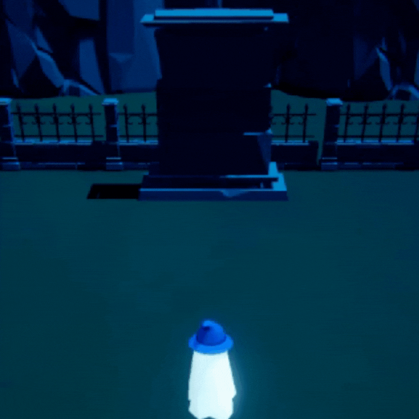

# Halloween-Themed Elemental Weapon System Game 🎃🔫

## 🚀 Game Mechanics

The main objective is to utilize the modular weapon system effectively. Each weapon has distinct effects and can be activated/deactivated.


## 📲 Features

- **Elemental Weapons**: Switch between three unique weapons—Fire, Ice, and Electricity.
- **Halloween Theme**: Engaging Halloween-inspired aesthetics and environments.
- **Optimized for Mobile**: Designed with Android compatibility in mind.
- **Dynamic Visual Effects**: Each weapon effect is created with Unity’s Shader Graph and VFX Graph.


## 🧩 Project Structure

### **Scripts Demonstrating OOP Principles**

The weapon system is built using an abstract base class `Weapon` and specific child classes for each elemental weapon (Fire, Ice, Electric). This structure demonstrates how OOP can be extensible and modular.

#### Weapon Base Class

```csharp
using System.Collections;
using System.Collections.Generic;
using UnityEngine;

public abstract class Weapon : MonoBehaviour
{
    public abstract void Activate();
    public abstract void Deactivate();
    public abstract void ApplyEffect();
}
```
### **Shader Graph and VFX Graph Setups**

Each weapon uses unique visual effects created using Shader Graph and VFX Graph. Below is a brief description of each setup:

#### Fire Effect 🔥

The fire weapon effect includes a vibrant, animated fire texture combined with particle-based flames to create a dynamic and fiery look.


#### Ice Effect ❄️

The ice effect involves frosty visuals with a cool color palette and particle effects that simulate snow or frost surrounding the weapon.


#### Electric Effect ⚡

The electric effect leverages lightning-like particle trails and sparks to simulate electricity, creating a powerful and electrifying appearance.



## 🔥 Demonstration

Each weapon's functionality and effects can be tested in-game by switching between Fire, Ice, and Electricity modes.


## 👨‍💻 Author & Contributions
Developed by Sujal Ramesh. Contributions are welcome! Feel free to open issues and submit pull requests.

[Repository Link](https://github.com/Sujal-Hiro/Elemental-Weapon-System.git)
